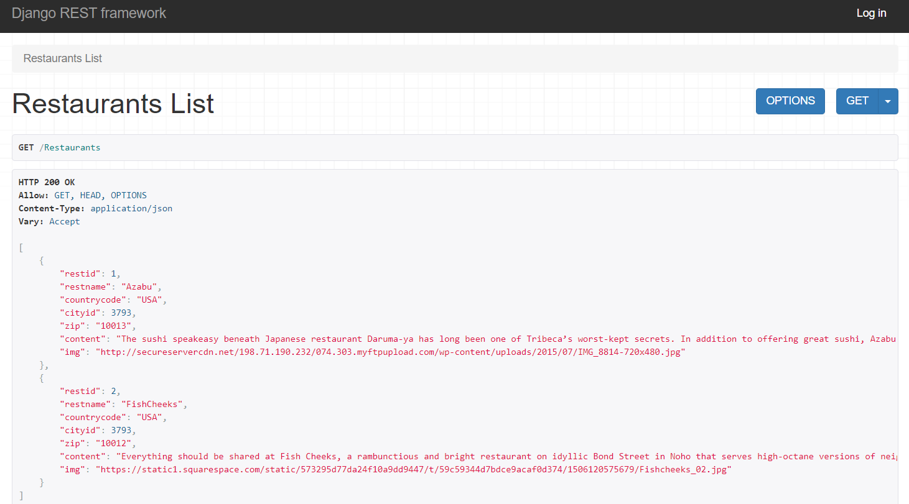
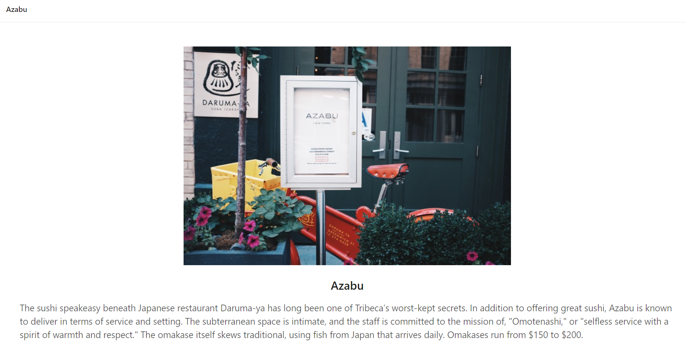

There is an SQL dump file there incase you want to run the site locally.

To run this app cd into the backend folder and run:

**python manage.py runserver**

### Django Backend API

Then cd into the frontend folder and run:

**npm start**

### Webapp at Restaurants detail view pk=1

